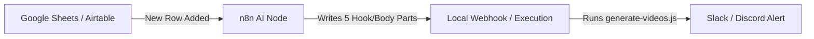
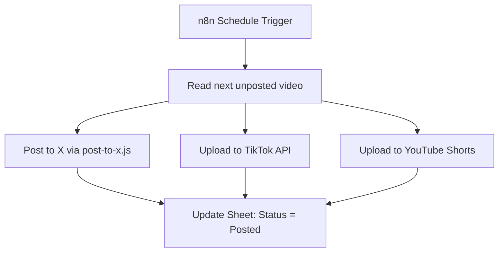

# Chronicled: n8n Video Automation Blueprints
*How to orchestrate your Puppeteer video generation and social publishing using n8n workflows.*

---

Since your video generator (`generate-videos.js`) runs locally by taking structured JSON data and rendering it via a headless Chrome canvas, **n8n is the perfect conductor** to automate the input, rendering, and distribution.

Below are **4 automation blueprints** you can build in n8n.

---

## 📋 Blueprint 1: The Spreadsheet-to-Video Pipeline (Batch Rendering)
*For creating a month’s worth of videos from a single document on autopilot.*



### 1. How It Works:
1. **Trigger:** You insert a new row in a **Google Sheet**, **Airtable**, or **Notion Database** containing only a high-level topic (e.g., *"The Mystery of the Secret Diary"*).
2. **AI Writer Node:** n8n calls an **OpenAI or Anthropic node** to write the story script, breaking it down into: `hook`, `body1`, `body2`, `body3`, `body4`, `body5`, and `takeaway`.
3. **Write to Config:** n8n appends this structured script directly to your local `stories.json`.
4. **Local Execution:** n8n triggers your local server using the **Execute Command** node:
   ```bash
   node C:\Users\night\Documents\ClaudeAgent\chronicled\scripts\generate-videos.js
   ```
5. **Notification:** Once completed, n8n sends a message to your **Slack, Telegram, or Discord** with the video title, file path, and a confirmation message.

### 2. Why Build It:
Instead of writing scripts, modifying JSON arrays manually, and running terminal commands, you simply write 10 topics in a spreadsheet, go make coffee, and find 10 premium `.webm` videos rendered and sitting in your `/public/videos` folder.

---

## 🚀 Blueprint 2: Multi-Platform Auto-Publisher
*Set-and-forget publishing that schedules and posts videos across all networks.*



### 1. How It Works:
1. **Trigger:** A cron-based **Schedule Trigger** in n8n runs daily (e.g., every morning at 9:00 AM).
2. **Retrieve Video:** n8n checks your database (or local file folder) for the next `.webm` video in the queue that has not been posted yet.
3. **Multi-Channel Distribution:**
   * **Twitter/X:** Runs your `post-to-x.js` script with the video file parameter.
   * **TikTok / YouTube Shorts / Instagram Reels:** Uses n8n's **HTTP Request node** (or native app integrations) to upload the video file directly to their creator API endpoints.
4. **Mark as Done:** Updates the status of that video in your database to `Posted` with the timestamp and link.

### 2. Why Build It:
This removes the daily friction of logging into multiple social channels, drafting captions, and manually uploading files. 

---

## 📰 Blueprint 3: The "Viral Trend" Automated Video Creator
*Keep your channel trending by auto-generating videos on breaking news.*

### 1. How It Works:
1. **Trigger:** An n8n cron scheduler runs every 4 hours.
2. **Scrape Hot Topics:** n8n uses the **RSS Read** node or queries APIs (like Reddit, Google Trends, or Hacker News) to fetch the top 5 trending posts in your niche.
3. **Curate:** An LLM node filters the results and selects the single most engaging trending story.
4. **Generate Video:** The AI outputs the story parts directly to the generator, runs the headless browser export command, and creates the video locally.
5. **Publish / Review:** n8n emails you a preview link. If you reply "yes" to the email, it posts it automatically.

### 2. Why Build It:
In the attention economy, being the first to post about a trending news event is highly rewarded. This system generates a video on a breaking event within minutes of it hitting the news cycle.

---

## 💬 Blueprint 4: Interactive "Reply-With-Video" Bot
*Audience engagement bot that turns comment prompts into custom movies.*

### 1. How It Works:
1. **Trigger:** n8n listens for mentions or comments on X/Twitter, TikTok, or Discord (e.g. `@MyBot write a story about a hidden key`).
2. **Parse Input:** n8n extracts the user's prompt text and username.
3. **Render Video:** n8n generates a custom 34-second video based on their exact prompt using the Puppeteer renderer.
4. **Auto-Reply:** n8n uploads the output file and replies to their comment thread with: *"Here is your custom story, @username! [Video Link]"*.

### 2. Why Build It:
This has massive potential for viral growth. When users see they can get a custom-animated video created dynamically just by commenting, it creates an explosive feedback loop of engagement.
